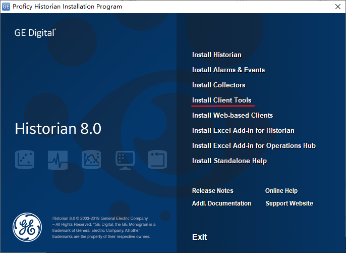
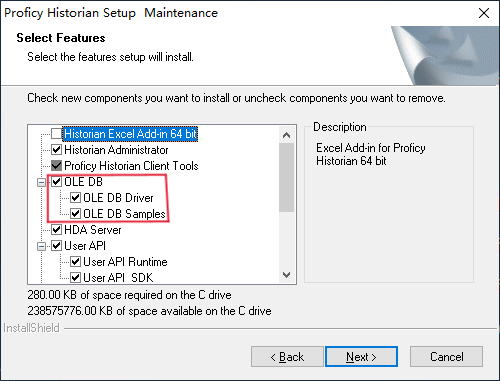
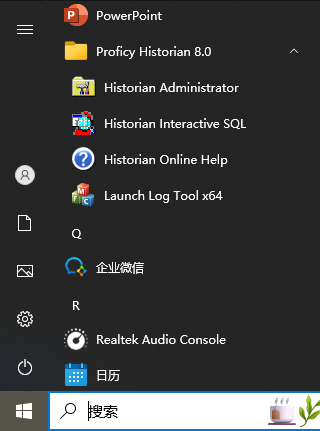

# Python 读取 iHistorian 数据库教程

## 简介
本项目提供了一个通过OLE DB接口读取 iHistorian 数据库的简单示例，帮助你快速上手如何从 iHistorian 数据库中提取数据，便于通过程序批量导出 iHistorian 数据库中的数据。  
导出 iHistorian 数据库中的数据是一个常见的需求。而受 iHistorian 的限制，通常每次只能查询到5000条数据，需要大批量导出数据时及其不方便。网络上也没有相关的教程，因此我编写了这个教程，希望能够帮助到有需要的人。

## 环境准备
### 安装 iHistorian 客户端
1. 选择“Install Client Tools”。  

2. 选择“OLE DB”。  

3. 安装完成后，你可以在开始菜单中找到 iHistorian 客户端。  

4. 安装完成后，需要测试能够正确连接到 iHistorian 数据库。

### 依赖安装
连接iHistorian数据库，需要使用pywin32库的win32com.client模块。先安装pywin32库：
```bash
pip install pywin32
```
## 示例代码
```python
import win32com.client

# 输入iHistorian数据库的相关信息
# iHistorian数据库使用windows身份验证，用户名和密码为windows的用户名和密码
# data_source为iHistorian数据库的名称，user_name为用户名，password为密码
data_source = "iHistorian Server"
user_name = "administrator"
password = "password"
 
# 连接iHistorian数据库
conn = win32com.client.Dispatch(r'ADODB.Connection')
# Provider工具为iHistorian客户端提供的"iHistorian OLE DB Provider"(非常重要)
conn.Open(f'PROVIDER=iHistorian OLE DB Provider;DATA SOURCE={data_source};USER ID={user_name};PASSWORD={password}')

# 读取iHistorian数据库中的数据
rs = win32com.client.Dispatch(r'ADODB.Recordset')
# 使用SQL语句查询iHistorian数据库中的数据
rs.Open("SELECT scada.steam_FT.F_CV.Value, timestamp FROM ihTrend WHERE timestamp > \"2024-11-01 00:00:00\" AND timestamp < \"2024-11-10 00:00:00\"",conn)

# 输出iHistorian数据库中的数据
# 具体使用方式参考可以pywin32的文档和ADO(ActiveX Data Objects)的文档
while not rs.EOF:
    for field in rs.Fields:
        print(f"{field.Name}: {field.Value}")
        i = i + 1
    rs.MoveNext()

# 关闭连接
rs.Close()
conn.Close()
···
